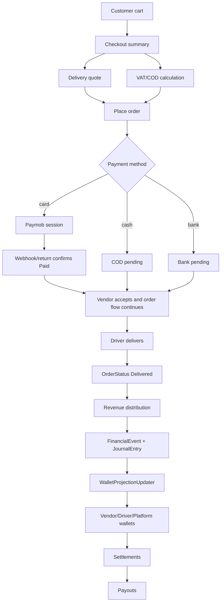
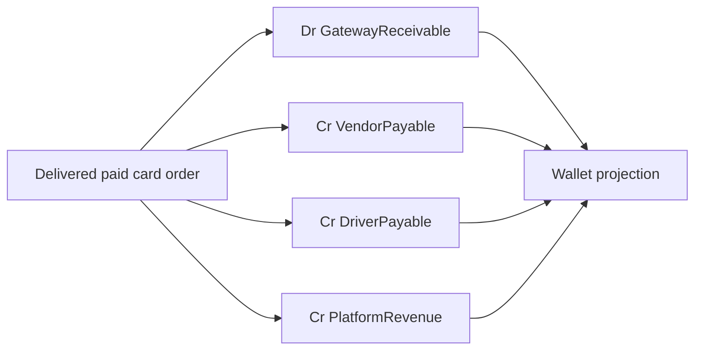
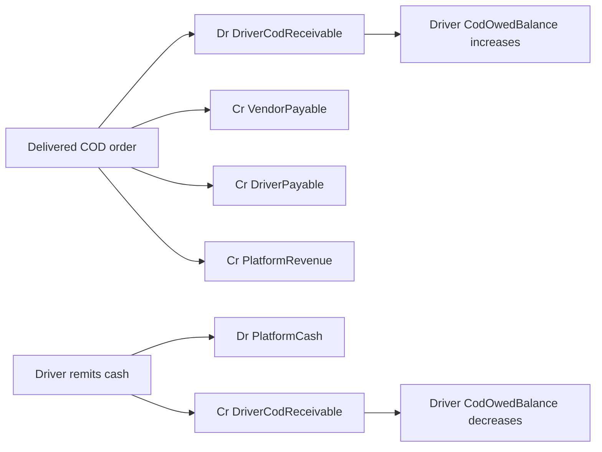

# شرح كامل للجزء المالي في Zadana

## الحالة

- `implemented / partially implemented`
- هذا الملف يشرح السلوك الحالي الموجود في الكود حتى تاريخ كتابة الملف.
- الهدف منه أن يكون مرجعًا واحدًا للـ product والـ backend والـ mobile والـ finance team.

## ملخص سريع

الجزء المالي في Zadana مبني على 5 طبقات:

1. `Checkout pricing`: حساب إجمالي الطلب قبل الإنشاء.
2. `Payment`: إنشاء سجل الدفع ومتابعة حالته.
3. `Order delivery completion`: عند اكتمال التوصيل يبدأ توزيع الإيراد.
4. `Ledger-first finance`: كل حركة مالية حقيقية تتحول إلى قيد متوازن في الدفتر.
5. `Wallet projections / settlements / payouts`: المحافظ والتسويات والسحوبات مبنية من القيود.

أهم قاعدة:

> الـ backend هو مصدر الحقيقة الوحيد لأي مبلغ مالي.  
> تطبيق العميل أو تطبيق المندوب لا يعيد حساب الرسوم أو العمولة أو مستحقات السحب محليًا.

## الأطراف المالية

| الطرف | Owner type | ماذا يملك ماليًا |
|---|---|---|
| العميل | Customer | يدفع إجمالي الطلب |
| التاجر | Vendor | يستحق صافي قيمة المنتجات بعد عمولة المنصة والاستردادات |
| المندوب | Driver | يستحق صافي رسوم التوصيل بعد عمولة المنصة على التوصيل |
| المنصة | Platform | تحصل عمولات التاجر، عمولة التوصيل، تحصيلات COD بعد توريدها، وأي recoveries |
| بوابة الدفع | Gateway | تمثل مبالغ الدفع الإلكتروني قبل التسوية الفعلية |

## مصادر الإعدادات المالية

### إعدادات التوصيل

حساب رسوم التوصيل يستخدم:

- `DeliveryPricingRule` على مستوى zone.
- `CityDeliveryPricingSettings` على مستوى المدينة.
- `RegionDeliveryPricingSettings` على مستوى المنطقة.
- `DeliveryPricingDefaults` كإعداد عام.
- fallback داخلي إذا لم توجد إعدادات.

ترتيب اختيار قاعدة التسعير الحالي:

1. zone rule لو العنوان داخل zone نشط.
2. city settings لو المدينة معروفة ومفعلة.
3. region settings لو المنطقة معروفة ومفعلة.
4. delivery defaults لو مفعلة.
5. system fallback.

### إعدادات VAT و COD

حساب VAT و COD في checkout يستخدم:

1. `ZoneFinanceSettings`.
2. `CityDeliveryPricingSettings`.
3. `RegionDeliveryPricingSettings`.
4. `DeliveryPricingDefaults`.
5. default داخلي:
   - `VatPercent = 15`
   - `CodFeeType = flat`
   - `CodFlatFee = 10`
   - `IsVatActive = true`
   - `IsCodFeeActive = true`

### إعدادات العمولة

- عمولة التاجر تأتي من `Vendor.CommissionRate`.
- عمولة المندوب على رسوم التوصيل تأتي من:
  - `FinancialSettings.DriverCommissionRatePercent`
  - default حاليًا `15%`.
- محفظة المنصة تستخدم:
  - `FinancialSettings.PlatformWalletOwnerId`.

## Flow 1: حساب سعر الطلب في checkout

### Endpoint الأساسي

```http
GET /api/checkout/summary?vendor_id={vendorId}&address_id={addressId}&delivery_slot_id={slotId}&payment_method={paymentMethod}
```

القيم canonical لـ `payment_method`:

- `card`
- `cash`
- `bank`
- `apple_pay` موجودة في القائمة لكنها غير مفعلة حاليًا.

الـ backend يقبل aliases مثل:

- `cod`
- `cash_on_delivery`
- `credit_card`
- `bank_transfer`

### خطوات الحساب

1. تحميل cart الخاصة بالعميل.
2. اختيار vendor قادر يوفر كل منتجات cart.
3. حساب `subtotal` من أسعار منتجات التاجر.
4. تحديد عنوان العميل.
5. حساب delivery quote.
6. تطبيق promo code لو موجود.
7. حساب VAT و COD حسب طريقة الدفع.
8. إرجاع summary نهائي للتطبيق.

### حساب التوصيل

التسعير الحالي يقسم الرحلة إلى جزئين:

- `driver -> vendor`
- `vendor -> customer`

لكل leg:

```text
extra_distance_fee = max(0, distance_km - included_km) * extra_km_fee
surge_fee = (base_fee + extra_distance_fee) * (multiplier - 1) لو يوجد surge active
leg_total = base_fee + extra_distance_fee + surge_fee
```

ثم يتم تطبيق:

- `MinDeliveryFee`
- `MaxDeliveryFee`
- `MinTotalDeliveryFee`
- `MaxTotalDeliveryFee`

الناتج:

```text
shipping_cost = driver_to_vendor_fee + vendor_to_customer_fee
```

الحقل الرسمي للعرض للعميل:

```text
summary.shipping_cost
```

### live vs estimated pricing

`pricing_mode` يمكن أن يكون:

- `live`: تم استخدام موقع مندوب متاح فعليًا.
- `estimated`: لم يوجد مندوب live مناسب، فتم استخدام fallback مثل مركز zone أو مركز city أو branch.

هذا لا يمنع الطلب. التطبيق لا يعيد الحساب عند `estimated`.

## Flow 2: VAT و COD ورسوم الدفع

### معادلة checkout الرسمية

```text
taxable_base = max(0, subtotal + shipping_cost - discount)
vat_amount = taxable_base * vat_percent / 100 إذا VAT مفعلة
cod_fee = قيمة COD إذا payment_method = cash و COD مفعلة
total = subtotal + shipping_cost - discount + vat_amount + cod_fee
```

### COD fee

لو `CodFeeType = flat`:

```text
cod_fee = CodFlatFee
```

لو `CodFeeType = percent`:

```text
cod_fee = taxable_base * CodPercent / 100
```

### Response مهم للتطبيق

```json
{
  "summary": {
    "subtotal": 100.0,
    "shipping_cost": 15.0,
    "discount": 10.0,
    "vat_amount": 15.75,
    "cod_fee": 10.0,
    "total": 130.75,
    "currency": "EGP"
  }
}
```

قواعد UI:

- يعرض `summary.total` كإجمالي نهائي.
- لا يحسب VAT أو COD محليًا.
- عند تغيير طريقة الدفع يجب إعادة طلب checkout summary.
- يخفي سطر VAT لو `vat_amount = 0`.
- يخفي سطر COD لو `cod_fee = 0`.

## Flow 3: إنشاء الطلب والدفع

### Endpoint

```http
POST /api/orders
```

مثال body:

```json
{
  "vendor_id": "11111111-1111-1111-1111-111111111111",
  "address_id": "22222222-2222-2222-2222-222222222222",
  "delivery_slot_id": "standard-30-45",
  "payment_method": "cash",
  "promo_code": "SAVE10",
  "notes": "Leave at the door"
}
```

### ماذا يحدث عند إنشاء الطلب؟

1. يتم إعادة حساب السعر من backend ولا يعتمد على أرقام التطبيق.
2. يتم تحديث cart totals بالـ delivery quote.
3. يتم إنشاء `Order`.
4. يتم حفظ snapshot مالي داخل order:
   - `Subtotal`
   - `DiscountTotal`
   - `DeliveryFee`
   - `BaseDeliveryFee`
   - `DistanceDeliveryFee`
   - `SurgeDeliveryFee`
   - `VatAmount`
   - `CodFee`
   - `CommissionAmount`
   - delivery pricing metadata
5. يتم إنشاء `Payment` بقيمة `order.TotalAmount`.

### معادلة `Order.TotalAmount`

```text
TotalAmount = max(0, subtotal - discountTotal + deliveryFee + vatAmount + codFee)
```

### حساب عمولة التاجر وقت إنشاء الطلب

لكل item:

```text
profit_per_unit = max(selling_price - trade_price, 0)
item_commission = profit_per_unit * quantity * vendor_commission_rate / 100
```

ثم:

```text
CommissionAmount = sum(item_commission)
```

مهم:

- لو `TradePrice` غير موجود، الطلب يفشل.
- العمولة هنا ليست نسبة من سعر البيع كله، بل من ربح التاجر بين selling و trade.

## Flow 4: طرق الدفع

### Card

1. يتم إنشاء order بحالة:
   - `OrderStatus.PendingPayment`
   - `PaymentStatus.Initiated`
2. يتم إنشاء `Payment`.
3. يتم طلب Paymob checkout session.
4. لو Paymob نجح:
   - `Payment.Status = Pending`
   - provider = `Paymob`
   - يرجع `iframeUrl`.
5. عند نجاح Paymob webhook أو return:
   - `Payment.Status = Paid`
   - `Order.PaymentStatus = Paid`
   - `Order.Status = PendingVendorAcceptance`
   - cart يتم تنظيفها.
   - يتم إرسال إشعارات للعميل والتاجر.

لو فشل إنشاء session، يتم حذف order/payment غير المؤكد.

### Retry card payment

```http
POST /api/orders/{orderId}/retry-payment
```

مسموح فقط إذا:

- الطلب Card.
- `Order.Status = PendingPayment`.
- الدفع ليس `Paid`.

الـ retry يفشل آخر payment pending/initiated ويعمل payment جديد بجلسة Paymob جديدة.

### Expiring stale card payments

`PendingPaymentExpirationWorker` يعمل كل دقيقة.

أي card payment قديم:

- `Initiated` أو `Pending`
- والطلب ما زال `PendingPayment`
- ولم يصبح `Paid`

يتم تحويله إلى:

```text
PaymentStatus.Failed
```

### Cash / COD

وقت إنشاء الطلب:

- `Payment.ProviderName = CashOnDelivery`
- `Payment.Status = Pending`
- الطلب ينتقل:
  - `Placed`
  - ثم `PendingVendorAcceptance`
- cart يتم حذفها مباشرة.

عند التسليم:

- المندوب يؤكد delivery OTP أو يعمل delivered transition.
- لو طريقة الدفع `CashOnDelivery`:
  - `Order.PaymentStatus = Paid`
  - `Payment.Status = Paid`

بعدها يصبح الطلب مؤهلًا لتوزيع الإيراد.

### Bank transfer

وقت إنشاء الطلب:

- `Payment.ProviderName = BankTransfer`
- `Payment.Status = Pending`
- الطلب ينتقل إلى `PendingVendorAcceptance`
- cart يتم حذفها.

ملاحظة مهمة:

- في الكود الحالي لا يوجد flow واضح لتأكيد bank transfer وتحويل `PaymentStatus` إلى `Paid`.
- توزيع الإيراد لا يتم لأي طريقة غير COD إلا إذا `PaymentStatus = Paid`.
- لذلك bank transfer يحتاج endpoint أو عملية admin confirmation قبل الاعتماد المالي الكامل.

### Apple Pay

- يظهر كطريقة دفع غير متاحة.
- لو تم إرسال `apple_pay` في place order يتم رفضه.

## Flow 5: اكتمال الطلب وبداية توزيع الإيراد

توزيع الإيراد يتم من:

```csharp
OrderRevenueDistributionService.DistributeAsync(orderId)
```

ويتم استدعاؤه عند أي `OrderStatusChangedNotification`.

لكن الخدمة لا توزع إلا لو الطلب مؤهل:

```text
Order.Status = Delivered
```

ثم حسب طريقة الدفع:

- COD: `PaymentStatus = Collected` أو `Paid`
- غير COD: `PaymentStatus = Paid`

### متى يصبح الطلب Delivered؟

من تطبيق المندوب:

- `PickedUp`
- `OnTheWay`
- `Delivered`

أو عبر delivery OTP:

- pickup OTP يحول الطلب إلى `PickedUp`.
- delivery OTP يحول الطلب إلى `Delivered`.

في حالة COD، delivery OTP أو delivered transition يعلّم الدفع `Paid`.

## Flow 6: توزيع الإيراد بعد التسليم

عند توزيع الإيراد:

```text
vendorGross = order.TotalAmount - order.DeliveryFee
vendorCommission = order.CommissionAmount
vendorNet = vendorGross - vendorCommission

driverGross = order.DeliveryFee
driverCommission = driverGross * DriverCommissionRatePercent / 100
driverNet = driverGross - driverCommission

platformNet = vendorCommission + driverCommission
```

لو توجد recoveries على التاجر:

```text
vendorNet -= recovered_amount
platformNet += recovered_amount
```

ملاحظة دقيقة حسب الكود الحالي:

- `vendorGross = TotalAmount - DeliveryFee`.
- بما أن `TotalAmount` يحتوي VAT و COD fee، فهذا يعني أن `vendorGross` الحالي يشمل VAT/COD.
- لو المطلوب محاسبيًا أن VAT/COD لا تدخل صافي التاجر، يحتاج تعديل واضح في معادلة التوزيع.

### idempotency

كل توزيع order يستخدم:

```text
idempotencyKey = order-revenue:{orderId}
```

لو التوزيع تم قبل ذلك، الخدمة تتخطى الطلب.

## Flow 7: Ledger-first finance

النظام المالي الحقيقي يبدأ من الدفتر وليس من wallet مباشرة.

الكائنات الأساسية:

- `FinancialEvent`
- `JournalEntry`
- `JournalLine`

أي posting يجب أن يكون:

- له `IdempotencyKey`.
- له `SequenceNumber`.
- متوازن:

```text
sum(debit) = sum(credit)
```

### الحسابات المالية

| Account code | الغرض |
|---|---|
| `PlatformCash` | كاش أو رصيد فعلي عند المنصة |
| `GatewayReceivable` | مبلغ مستحق من بوابة الدفع الإلكتروني |
| `VendorPayable` | التزام للمنصة تجاه التاجر |
| `DriverPayable` | التزام للمنصة تجاه المندوب |
| `DriverCodReceivable` | كاش COD في يد المندوب مطلوب توريده |
| `PlatformRevenue` | إيراد المنصة |
| `RefundExpense` | مصروف استرداد |
| `ManualAdjustment` | تعديلات يدوية |

## Flow 8: القيود المالية الأساسية

### Online payment delivered

عند تسليم طلب مدفوع إلكترونيًا:

```text
Dr GatewayReceivable      postingTotal
Cr VendorPayable          vendorNet
Cr DriverPayable          driverNet
Cr PlatformRevenue        platformNet
```

event:

```text
FinancialEventType.OnlinePaymentDelivered
```

### COD cash collected

عند تسليم طلب COD:

```text
Dr DriverCodReceivable    postingTotal
Cr VendorPayable          vendorNet
Cr DriverPayable          driverNet
Cr PlatformRevenue        platformNet
```

event:

```text
FinancialEventType.CodCashCollected
```

المعنى:

- المندوب جمع كاش من العميل.
- هذا الكاش أصبح مستحقًا على المندوب للمنصة.
- في نفس الوقت التاجر والمندوب والمنصة لهم حقوق محاسبية من الطلب.

### COD remittance

عندما يسلم المندوب الكاش للمنصة:

```http
POST /api/admin/finances/cod-remittances
```

القيد:

```text
Dr PlatformCash
Cr DriverCodReceivable
```

النتيجة:

- يزيد كاش المنصة.
- يقل `CodOwedBalance` على المندوب.

### Vendor payout paid

عند نجاح تحويل payout للتاجر:

```text
Dr VendorPayable
Cr PlatformCash
```

event:

```text
FinancialEventType.VendorPayoutPaid
```

### Driver payout paid

عند دفع سحب للمندوب:

```text
Dr DriverPayable
Cr PlatformCash
```

event:

```text
FinancialEventType.DriverPayoutPaid
```

### Admin wallet adjustment

```http
POST /api/admin/wallets/{walletId}/adjustments
```

يعمل قيدين على `ManualAdjustment`:

- line للـ offset.
- line لصاحب المحفظة.

ثم يتم تحديث wallet projection.

## Flow 9: Wallet projections

المحافظ لا يجب أن تكون مصدر القيود، بل projection من الدفتر.

بعد كل journal entry مهم:

```csharp
WalletProjectionUpdater.ApplyJournalEntryAsync(journalEntryId)
```

### الحسابات التي تؤثر على المحافظ

| Account | تأثيره على wallet |
|---|---|
| `VendorPayable` | يزيد/ينقص `CurrentBalance` للتاجر |
| `DriverPayable` | يزيد/ينقص `CurrentBalance` للمندوب |
| `PlatformRevenue` | يزيد/ينقص `CurrentBalance` للمنصة |
| `ManualAdjustment` | يزيد/ينقص `CurrentBalance` |
| `DriverCodReceivable` | يزيد/ينقص `CodOwedBalance` للمندوب |

### اتجاه المعاملة في WalletTransaction

لأي حساب عادي:

```text
credit => IN
debit  => OUT
```

لـ `DriverCodReceivable`:

```text
debit  => OUT
credit => IN
```

لذلك:

- عند COD collection يظهر على wallet كـ cash obligation.
- عند remittance يقل الدين.

### Rebuild and reconciliation

لإعادة بناء المحافظ من الدفتر:

```http
POST /api/admin/finances/rebuild-wallet-projections
```

للتأكد من عدم وجود فرق بين wallet والدفتر:

```http
GET /api/admin/finances/reconciliation-report
```

## Flow 10: محفظة المندوب

### Endpoint summary

```http
GET /api/drivers/wallet
```

يرجع:

- `currentBalance`
- `availableToWithdraw`
- `pendingBalance`
- `codOwedBalance`
- `netWithdrawable`
- `todayEarnings`
- `weekEarnings`
- `monthEarnings`
- `recentTransactions`
- `paymentMethods`
- `withdrawalSummary`

المعادلة الحالية:

```text
netWithdrawable = max(0, CurrentBalance - CodOwedBalance - PendingBalance)
```

### Transactions

```http
GET /api/drivers/wallet/transactions?page=1&pageSize=20
```

### Payout methods

```http
GET    /api/drivers/wallet/payment-methods
POST   /api/drivers/wallet/payment-methods
PUT    /api/drivers/wallet/payment-methods/{id}
DELETE /api/drivers/wallet/payment-methods/{id}
POST   /api/drivers/wallet/payment-methods/{id}/make-primary
```

الأنواع المدعومة:

- `BankAccount`
- `DebitCard`
- `InstantTransfer`

لو تم حذف primary method، النظام يحاول جعل أحدث method بديل primary.

لا يمكن حذف payout method لو لها withdrawal history.

### طلب سحب مندوب

```http
POST /api/drivers/wallet/withdrawals
```

body:

```json
{
  "paymentMethodId": "55555555-5555-5555-5555-555555555555",
  "amount": 300.0
}
```

الشروط:

- وجود payout method، أو primary payout method لو لم يرسل `paymentMethodId`.
- `CodOwedBalance` يجب أن يكون `0`.
- المبلغ لا يتجاوز `CurrentBalance - CodOwedBalance`.

لو الشروط نجحت:

- يتم إنشاء `DriverWithdrawalRequest`.
- الحالة تبدأ `Pending`.
- يتم إرسال notification للمندوب.
- يتم إرسال admin alert للمراجعة.

ملاحظة حسب الكود الحالي:

- إنشاء withdrawal request لا يعمل `wallet.Hold(amount)` فعليًا.
- الحجز الحقيقي للرصيد غير مطبق في create withdrawal الحالي.
- الخصم من رصيد المندوب يحدث عند موافقة الأدمن ودفع السحب عبر ledger posting.

### معالجة السحب من الإدارة

```http
POST /api/admin/wallets/withdrawals/{id}/process
```

لو `IsApproved = true`:

- `withdrawal.MarkPaid(...)`
- posting:

```text
Dr DriverPayable
Cr PlatformCash
```

- wallet projection تحدث رصيد المندوب.
- notification للمندوب.

لو `IsApproved = false`:

- `withdrawal.MarkFailed(...)`
- لا يوجد posting مالي.

## Flow 11: COD reconciliation

### كل المندوبين الذين عليهم COD

```http
GET /api/admin/finances/cod-reconciliation
```

يرجع:

- `driverId`
- `driverName`
- `driverPhone`
- `codOwedBalance`
- `lastJournalSequence`

### تفاصيل مندوب واحد

```http
GET /api/admin/finances/cod-reconciliation/{driverId}
```

يرجع آخر journal lines الخاصة بـ:

```text
DriverCodReceivable
```

### تسوية COD

```http
POST /api/admin/finances/cod-remittances
```

body:

```json
{
  "driverId": "11111111-1111-1111-1111-111111111111",
  "amount": 500.0,
  "reference": "cash deposit receipt #123",
  "idempotencyKey": "cod-remittance-driver-111-2026-05-18",
  "platformOwnerId": "00000000-0000-0000-0000-000000000001"
}
```

قاعدة مهمة:

- لا يجب السماح للمندوب بالسحب طالما `CodOwedBalance > 0`.

## Flow 12: تسويات التجار والمندوبين

### Settlement model

`Settlement` يمكن أن يكون:

- Vendor settlement
- Driver settlement

ويحمل:

- `OwnerType`
- `OwnerId`
- `Origin`
- `Status`
- `ResolutionType`
- `PeriodFrom`
- `PeriodTo`
- `GrossAmount`
- `CommissionAmount`
- `RefundAmount`
- `AdjustmentAmount`
- `RecoveryAmount`
- `NetAmount`

معادلة `NetAmount`:

```text
NetAmount = GrossAmount - CommissionAmount - RefundAmount + AdjustmentAmount - RecoveryAmount
```

### Origins

- `ManualBatch`
- `DirectPerOrder`
- `ScheduledCycle`

### Resolution types

- `BankPayout`
- `NoTransferRequired`
- `CarryForward`
- `OffsetAgainstDebt`

### Settlement statuses

- `Pending`
- `PendingReview`
- `Approved`
- `OnHold`
- `Processing`
- `Settled`
- `PaidOut`
- `PayoutFailed`
- `Failed`
- `Reversed`
- `Rejected`
- `Disputed`

### Manual/admin generate

```http
POST /api/admin/settlements/generate
```

يقرأ journal lines غير المسواة من:

- `VendorPayable` للتاجر.
- `DriverPayable` للمندوب.

داخل الفترة:

- `PeriodFrom`
- `PeriodTo`

ثم ينشئ:

- `Settlement`
- `SettlementItems`
- `Payout` لو `net > 0` والـ resolution هو `BankPayout`.

### Scheduled vendor settlement worker

`VendorSettlementCycleWorker` يعمل كل 6 ساعات.

يعتمد على:

- `WeeklySettlementDayOfWeek`
- `BiweeklySettlementDaysOfMonth`
- `MonthlySettlementDayOfMonth`

ويختار التجار حسب:

- `VendorFinancialLifecycleMode.Weekly`
- `Biweekly`
- `Monthly`

ثم:

1. يقرأ vendor wallet.
2. يجمع `OrderRevenue` transactions غير المسواة.
3. يبحث عن primary bank account.
4. ينشئ settlement.
5. ينشئ settlement items.
6. ينشئ payout.

ملاحظة حالية:

- `VendorPayoutWalletService.EnsureHoldAsync` موجود لكنه stub ولا يغير wallet فعليًا.

### Per order direct payout

لو التاجر عنده:

```text
VendorFinancialLifecycleMode.PerOrderDirectPayout
```

بعد توزيع إيراد الطلب:

- يتم إنشاء settlement للطلب.
- يتم إنشاء payout بقيمة `vendorNet`.
- يحاول النظام عمل hold عبر `VendorPayoutWalletService.EnsureHoldAsync`.

لكن hold الحالي غير مطبق فعليًا لأنه stub.

## Flow 13: Payouts

### Admin endpoints

```http
GET  /api/admin/payouts
GET  /api/admin/payouts/{id}
POST /api/admin/payouts/{id}/trigger
POST /api/admin/payouts/{id}/retry
POST /api/admin/payouts/{id}/cancel
```

### Trigger payout

عند trigger:

1. يتم تحميل `Payout` مع `Settlement`.
2. يجب أن Paymob payouts مفعلة.
3. لا يمكن trigger لو payout:
   - `Paid`
   - `Cancelled`
4. payout يصبح `Processing`.
5. settlement يصبح `Processing`.
6. يتم تسجيل `PayoutAttempt`.
7. يتم إرسال الطلب إلى Paymob payout gateway.

لو Paymob قبل التحويل:

- `Payout.Status = Queued`
- `ProviderTransferId` يتم حفظه.

لو Paymob رفض:

- `Payout.Status = Failed`
- `Settlement.Status = PayoutFailed`
- admin alert.

### Payout webhook

```http
POST /api/payments/paymob/payout-webhook
```

عند callback:

- status `paid/success/succeeded`:
  - `Payout.Status = Paid`
  - `Settlement.Status = PaidOut`
  - posting payout paid:

```text
Dr VendorPayable أو DriverPayable
Cr PlatformCash
```

- status `failed/failure/rejected`:
  - `Payout.Status = Failed`
  - `Settlement.Status = PayoutFailed`
  - admin alert.

### Cancel payout

لو payout ليس `Paid`:

- `Payout.Status = Cancelled`
- settlement يرجع `OnHold`.

## Flow 14: المرتجعات والاستردادات

### إنشاء return/refund case

العميل لا يستطيع فتح return request إلا إذا:

```text
Order.Status = Delivered
```

### الموافقة على return request

عند approve:

1. يتم تحديد `approvedAmount`.
2. يتم تحديد compensation حسب طريقة الدفع.
3. يتم تحديث support case.
4. يتم تحديث order/payment status.
5. يتم عمل restock.
6. يتم إنشاء vendor recovery لو التكلفة على التاجر أو shared.

### COD returns

لو الطلب COD:

- مسموح فقط `coupon` compensation.
- يتم إنشاء coupon:
  - code يبدأ بـ `RET-`
  - fixed discount بقيمة approved amount.
  - صالح 30 يوم.
  - usage limit = 1.
  - per user limit = 1.

ثم:

- `PaymentStatus = Refunded` أو `PartiallyRefunded`
- `OrderStatus = Refunded`

### Online paid returns

لو الطلب online:

- مسموح فقط `same_method`.
- يتم إنشاء أو تحديث `Refund`.
- `Refund.Status = Refunded`.
- `PaymentStatus = Refunded` أو `PartiallyRefunded`.
- `OrderStatus = Refunded`.

### Vendor recovery

لو `costBearer`:

- `vendor`: التاجر يتحمل كامل approved amount.
- `shared`: التاجر يتحمل نصف approved amount.
- غير ذلك: المنصة تتحمل.

لو هناك payout/settlement غير مدفوع:

- يتم خصم recovery من settlement item.
- يتم تقليل payout amount.

لو لم يكف أو لم يوجد payout قابل للخصم:

- يبقى recovery pending.
- يتم خصمه من future settlements عند توزيع إيراد طلبات لاحقة.

ملاحظة حالية مهمة:

- يوجد enum `FinancialEventType.RefundIssued` و account `RefundExpense`.
- لكن لا يوجد posting ledger واضح للاسترداد في الكود الحالي.
- لذلك refund الحالي يغير order/payment/support state ويعمل vendor recovery، لكنه لا ينشئ قيد ledger مستقل للاسترداد.

## Flow 15: Dashboard المالي

```http
GET /api/admin/finances/dashboard/snapshot?period=month
```

الفترات:

- `today`
- `week`
- `month`
- `quarter`

يعتمد على الطلبات:

```text
Order.Status = Delivered
DeliveredAtUtc >= startDate
```

KPIs:

- `GrossCollections`
- `PlatformNetRevenue`
- `CommissionRevenue`
- `DeliveryRevenue`
- `CodFeesCollected`
- `VatCollected`
- `DriverPayouts`
- `RefundExposure`

ملاحظات دقة:

- `serviceFees` محسوبة تقديريًا كـ `5%` من subtotal، لأنها غير محفوظة تفصيليًا في order.
- `driverPayouts` في dashboard محسوبة تقديريًا كـ `80%` من delivery fees.
- العملة في dashboard مكتوبة `SAR` حاليًا، بينما checkout والledger يستخدمان `EGP` في مواضع كثيرة. يلزم توحيد العملة إذا المنتج يستهدف عملة واحدة.

## Flow 16: Admin endpoints المهمة

### Finance settings

```http
GET /api/admin/finances/pricing-settings
PUT /api/admin/finances/pricing-settings/{zoneId}

GET /api/admin/finances/city-pricing
PUT /api/admin/finances/city-pricing/{cityId}

GET /api/admin/finances/region-pricing
PUT /api/admin/finances/region-pricing/{regionId}

GET /api/admin/finances/delivery-defaults
PUT /api/admin/finances/delivery-defaults
```

### Ledger

```http
GET /api/admin/finances/ledger
GET /api/admin/finances/ledger/{entryId}
```

filters:

- `orderId`
- `settlementId`
- `payoutId`
- `page`
- `pageSize`

### Wallets

```http
GET  /api/admin/wallets
GET  /api/admin/wallets/{id}
GET  /api/admin/wallets/{id}/transactions
POST /api/admin/wallets/{id}/adjustments
```

### Withdrawals

```http
GET  /api/admin/wallets/withdrawals
POST /api/admin/wallets/withdrawals/{id}/process
```

### Settlements

```http
GET  /api/admin/settlements
GET  /api/admin/settlements/{id}
POST /api/admin/settlements/generate
POST /api/admin/settlements/{id}/approve
POST /api/admin/settlements/{id}/hold
POST /api/admin/settlements/{id}/reject
POST /api/admin/settlements/{id}/resolve-dispute
```

### Payouts

```http
GET  /api/admin/payouts
GET  /api/admin/payouts/{id}
POST /api/admin/payouts/{id}/trigger
POST /api/admin/payouts/{id}/retry
POST /api/admin/payouts/{id}/cancel
```

## Flow 17: Mobile contracts

### Customer app

مصدر الحقيقة:

- `GET /api/checkout/summary`
- `POST /api/orders`
- `GET /api/orders/{orderId}`
- `GET /api/orders/{orderId}/refund-status`

المطلوب:

- اعرض `summary.shipping_cost`.
- اعرض `summary.total`.
- أرسل نفس `payment_method` في summary و place order.
- أعد طلب summary بعد تغيير:
  - العنوان
  - التاجر
  - delivery slot
  - طريقة الدفع
  - promo code

### Driver app

مصدر الحقيقة:

- `GET /api/drivers/wallet`
- `GET /api/drivers/wallet/transactions`
- `GET /api/drivers/wallet/payment-methods`
- `POST /api/drivers/wallet/withdrawals`
- `GET /api/drivers/wallet/withdrawals`

المندوب لا يحسب:

- delivery pricing.
- payout preview.
- COD owed.
- withdrawable balance.

كل هذا يأتي من backend.

## Mermaid overview



## Mermaid ledger examples

### Card order delivered



### COD order delivered and remitted



## أهم القيود والفجوات الحالية

1. Bank transfer لا يملك confirmation flow واضح في الكود الحالي.
2. Vendor payout hold methods موجودة لكنها stub ولا تغير balances.
3. Driver withdrawal creation لا يعمل hold للرصيد؛ الخصم يحدث عند admin approval.
4. Refunds لا تنشئ ledger posting مستقل رغم وجود enum/account للاسترداد.
5. `vendorGross = TotalAmount - DeliveryFee` يجعل VAT و COD داخل صافي التاجر الحالي.
6. Admin finance dashboard يستخدم تقديرات لبعض KPIs وليس ledger-accurate بالكامل.
7. العملة غير موحدة نصيًا بين بعض المواضع (`EGP` و `SAR`).
8. Apple Pay غير مفعلة.

## توصيات تنفيذية للمرحلة القادمة

1. إضافة bank transfer confirmation endpoint يحول payment إلى `Paid`.
2. تنفيذ ledger posting للاستردادات باستخدام `RefundIssued` و `RefundExpense`.
3. حسم هل VAT و COD fee يجب أن تدخل vendor net أم platform/tax liability.
4. تنفيذ real holds للتسويات والسحوبات بدل stubs.
5. جعل dashboard يعتمد على ledger بدل تقديرات.
6. توحيد العملة في كل contracts والـ DTOs.
7. إضافة audit screen يربط:
   - order
   - payment
   - financial event
   - journal entry
   - wallet transactions
   - settlement
   - payout

